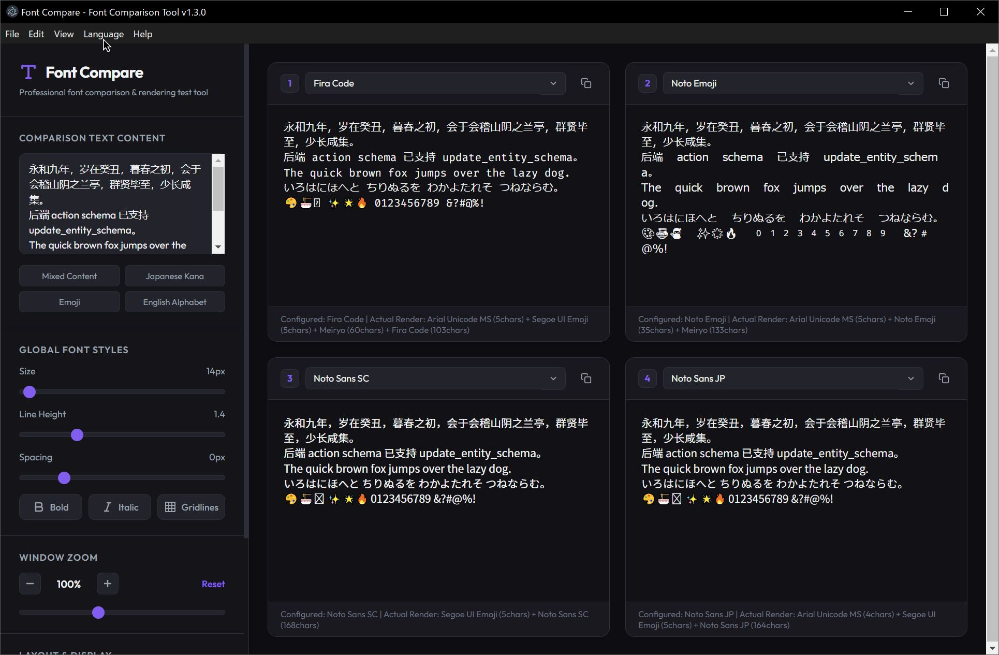
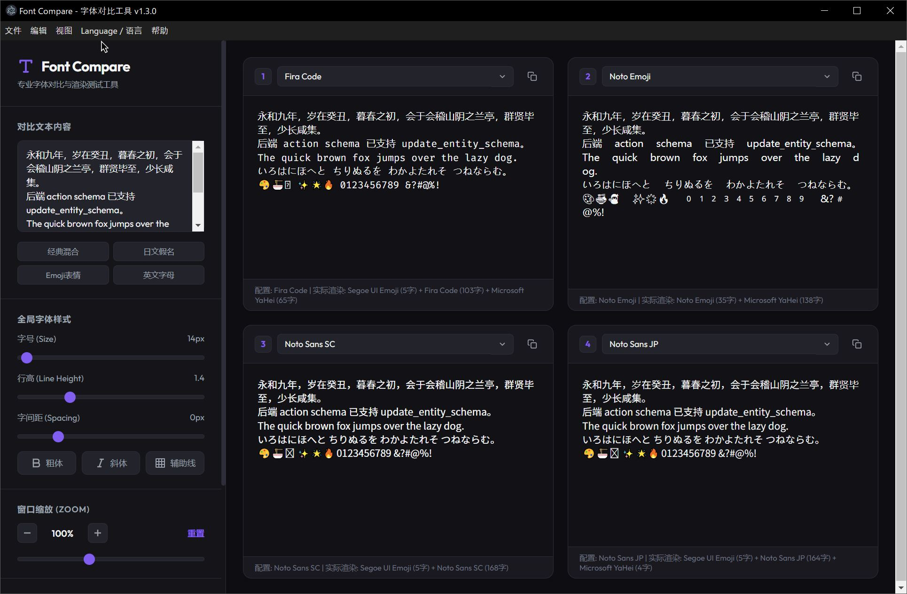
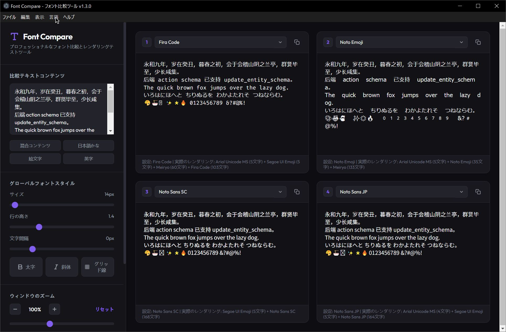
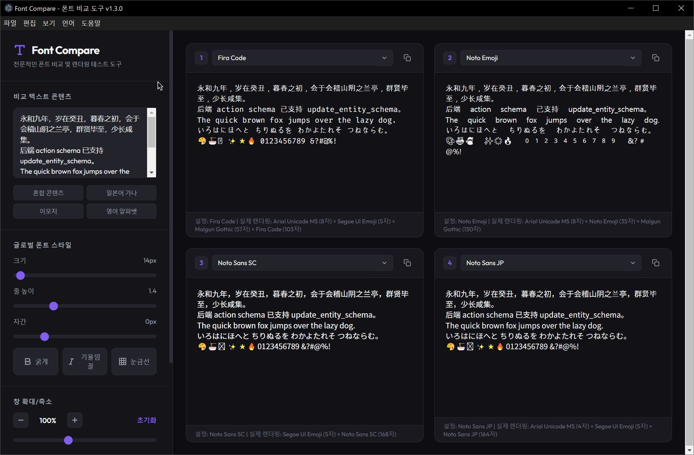

# Font Compare (폰트 비교 도구)

폰트를 나란히 비교할 수 있는 강력한 크로스 플랫폼 Electron 애플리케이션입니다.
디자이너, 개발자 및 타이포그래피 애호가에게 완벽한 도구입니다.

[English](README.md) | [简体中文](README.zh-CN.md) | [日本語](README.ja.md)

## 스크린샷

| English | 简体中文 |
| --- | --- |
|  |  |

| 日本語 | 한국어 |
| --- | --- |
|  |  |

## ✨ 주요 기능

- **나란히 비교**: 최대 4개의 폰트를 동시에 실시간으로 비교합니다.
- **핵심 기능: 실제 렌더링 폰트 검사기**: Chrome DevTools Protocol(CDP)을 활용하여 텍스트를 렌더링하는 데 실제로 사용되는 대체(Fallback) 폰트를 정확히 보여줍니다. 이모지나 문자가 제대로 표시되지 않는 이유를 더 이상 추측할 필요가 없습니다!
- **상태 영구 저장**: 폰트 선택, 텍스트 입력 및 설정(크기, 레이아웃, 확대/축소)이 자동으로 저장되고 시작 시 복원됩니다.
- **고급 타이포그래피 제어**: 폰트 크기, 줄 높이, 자간, 글꼴 두께(굵게) 및 스타일(기울임꼴)을 조정합니다.
- **서브픽셀 안티앨리어싱**: 최적화된 CSS는 계단 현상 없이 선명한 서브픽셀 ClearType 폰트 렌더링을 보장합니다.
- **그리드 / 리스트 레이아웃**: 2x2 그리드 또는 수직 리스트 레이아웃 간에 전환합니다.

## 🚀 빠른 시작

### 전제 조건
- Node.js (v16 이상)
- npm

### 설치

1. 저장소 클론:
   ```bash
   git clone https://github.com/fangsunjian/Font-Compare.git
   cd Font-Compare
   ```

2. 종속성 설치:
   ```bash
   npm install
   ```

3. 애플리케이션 시작:
   ```bash
   npm start
   ```

## 🛠️ 사용된 기술

- [Electron](https://www.electronjs.org/) - 크로스 플랫폼 데스크탑 앱 프레임워크
- HTML5 / CSS3 / Vanilla JavaScript

## 📝 라이선스

이 프로젝트는 MIT 라이선스에 따라 라이선스가 부여됩니다.
